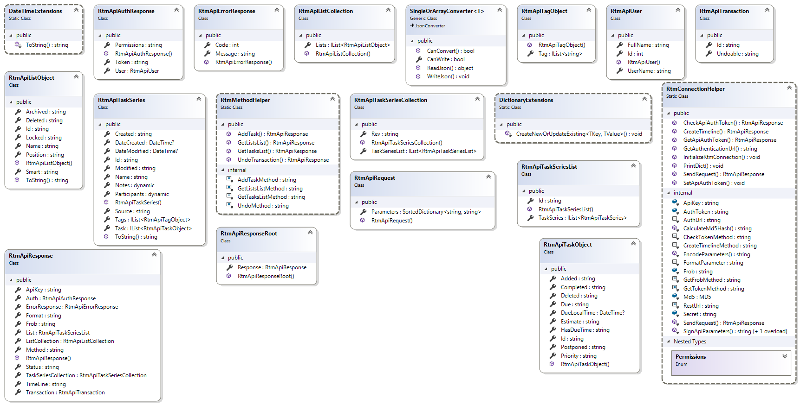

# RememberTheMilkApi

A .NET API library for Remember The Milk

### Requirenments 

In order to use this library, you must apply for your own Remember The Milk's [API keys](https://www.rememberthemilk.com/services/api/keys.rtm).

### Note

This product uses the [Remember The Milk API](https://www.rememberthemilk.com/services/api/) but is not endorsed or certified by Remember The Milk.

### Documentation

Generated by Doxygen, you can find it here: <https://codemonkey85.github.io/RememberTheMilkApi>

The UML Diagramm:

